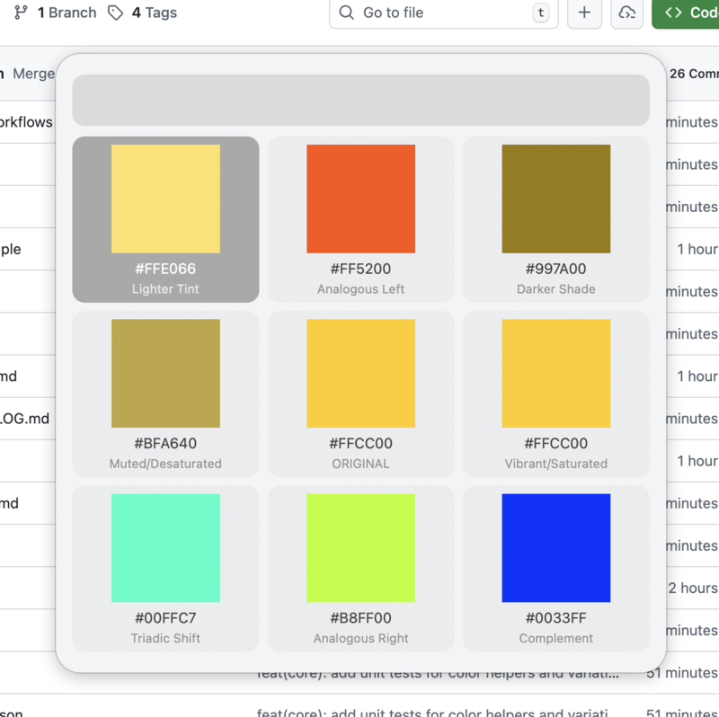

# ChromaKey Palette

[](https://github.com/whomwah/alfred-chromakey-workflow/releases/latest)

Your personal color theory assistant. Visualizes 9 distinct variations of any hex color in a beautiful interactive grid.

An [Alfred](https://www.alfredapp.com/) workflow for macOS.



## Features

Enter any hex color and instantly see 9 variations in a 3x3 grid:

| | | |
|---|---|---|
| Lighter Tint | Analogous Left | Darker Shade |
| Muted/Desaturated | **ORIGINAL** | Vibrant/Saturated |
| Triadic Shift | Analogous Right | Complement |

- Select any color to copy its hex code to clipboard
- Color swatches are generated as visual icons
- Supports 3-char (`f00`) and 6-char (`ff0000`) hex codes
- Works with or without the `#` prefix

## Installation

### Requirements

- macOS
- [Alfred](https://www.alfredapp.com/) with [Powerpack](https://www.alfredapp.com/powerpack/)
- [ImageMagick](https://imagemagick.org/) (`brew install imagemagick`)

### Download

Download the latest `.alfredworkflow` file from [Releases](https://github.com/whomwah/alfred-chromakey-workflow/releases) and double-click to install.

### From Source

```bash
git clone https://github.com/whomwah/alfred-chromakey-workflow.git
cd alfred-chromakey-workflow
just setup
```

## Usage

1. Open Alfred
2. Type `c` followed by a space and a hex color
3. Select a color variation to copy it to clipboard

Examples:
- `c ff5500`
- `c #3498db`
- `c f00`

## Development

### Prerequisites

- [Bun](https://bun.sh/) - JavaScript runtime and bundler
- [just](https://github.com/casey/just) - Command runner

### Build Commands

```bash
# Build (compile TypeScript and inject into info.plist)
just build

# Type check only
just check

# Install to Alfred (creates symlink)
just install

# Full setup (build + install)
just setup

# Uninstall from Alfred
just uninstall
```

### Configuration

Copy `.env.example` to `.env` and adjust the values for your system:

```bash
cp .env.example .env
```

| Variable | Description | Default |
|----------|-------------|---------|
| `WORKFLOW_DIR` | Path to Alfred's workflows directory | `$HOME/alfred/sync_folder/Alfred.alfredpreferences/workflows` |
| `LINK_NAME` | Name for the symlink in the workflows directory | `alfred-chromakey-workflow` |

**Finding your workflow directory:** Open Alfred Preferences → Advanced → Set preferences folder. Your workflows are at `{preferences_folder}/workflows`.

## License

MIT

## Credits

Created by [Duncan Robertson](https://github.com/whomwah)
